# compstruc1D

  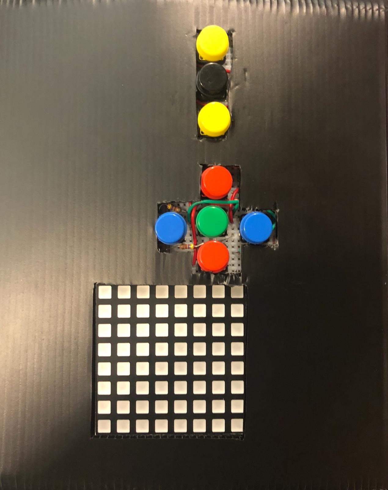

## Introduction
The aim for this project is to create a simple game to entertain and engage people of all ages to test and challenge their brains in memorising patterns on single board. The premise of game is to memorise patterns displayed on the board in certain intervals and certain patterns, which will be displayed on the LED board of the console.

Using this game that we have designed we question whether it is possible for people to surpass the average (7 ± 2) bits of information retained in the short term memory. While it is true that it requires no strategy whatsoever, the game was designed to be ever engaging to the users as it will simulate the need to achieve.

## User Manual
1. The game will start when the player chooses a difficulty level -- done by pressing a level button.
Level 1: 4-item sequence		Level 2: 8-item sequence 	
Level 3: 10-item sequence

  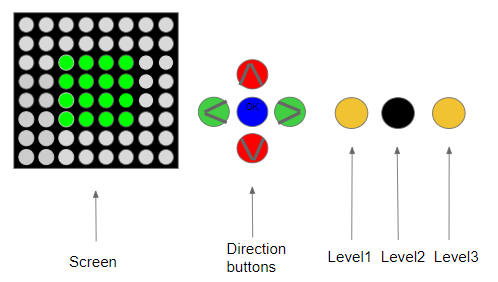

2. After choosing a level, the game will start immediately by displaying the sequence in order. NOTE that the order of the sequences is important.

  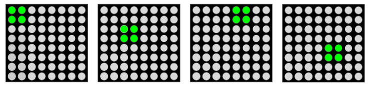

3. The LEDs light up after the whole sequence is shown.

  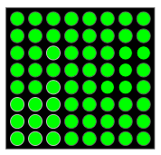

4. It’s time for you to give a shot! 
The cursor appears at the bottom-right corner. You can start after waiting for one second.  Press the direction buttons and OK to allocate the patterns one by one.

  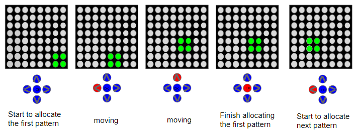

5. If the player chooses the wrong position, the LEDs in the middle will light up. Otherwise, the whole screen will light up upon completing the whole sequence correctly.

  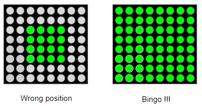

6. Press OK to restart the game.

## 2. Game description, State Diagram, Beta Architechture
### 2.1 Game description:
The game built is a game to test player’s memory capacity and challenge them to remember different number of patterns in a short amount of time. The goal of the game is to match the pattern of the LEDs with the pattern shown at the start of the game. 
The goal of the game is very simple and as such we have added additional challenge to the game by adding different levels of difficulty to further challenge the mind. The game will have three levels of difficulty with three different lengths of light pattern shown on the board.

### 2.2 State Diagram

  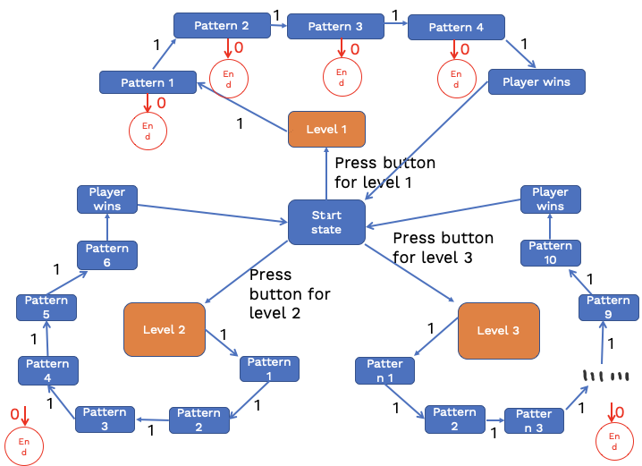

### 2.3 Beta Architechture

  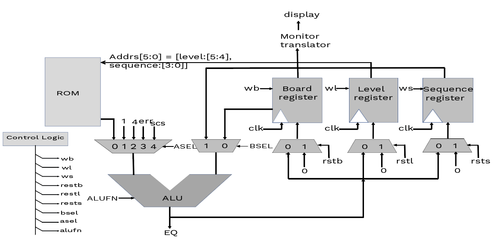

## Components
- MOJO FPGA
- Led RGB Matrix
- Resistors
- Buttons
- Bread Board
- Wires
- Wooden Board

## Appendix

### ALU Design and Test

  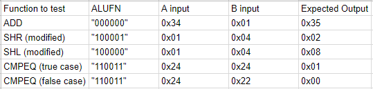

### Schematics

  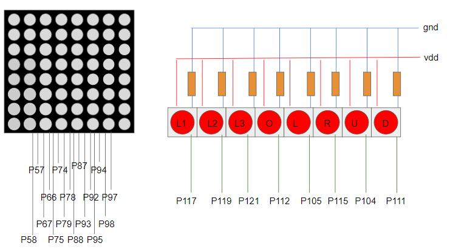

### LED Matrix Specs

  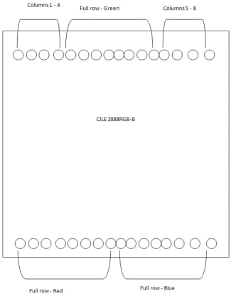

## Team
- Ivan Christian
- James Andrew Pohadi
- Gou Yuan Yuan
- Rachel Chua
- Wang Zi Jia
